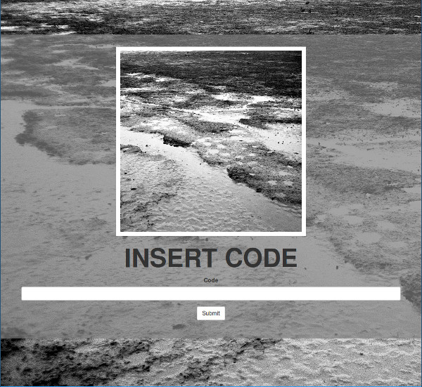

MusicCodes
==========

A webapp for generating and managing download codes and serving the files.



## Usage ##

```
Usage:
    MusicCodes.py run
    MusicCodes.py create <number>
    MusicCodes.py add <number>
    MusicCodes.py show
    MusicCodes.py voucher <from> <to>
    MusicCodes.py reset <code>

```

## Todo ##
The `voucher` function is missing. Its planned to generade a PDF with the download-code-vouchers.
